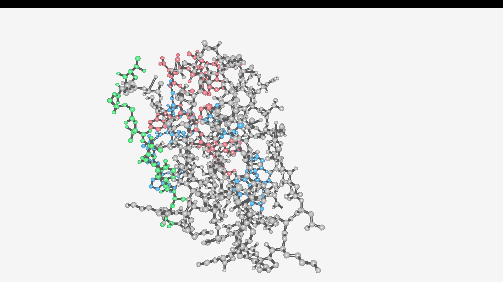
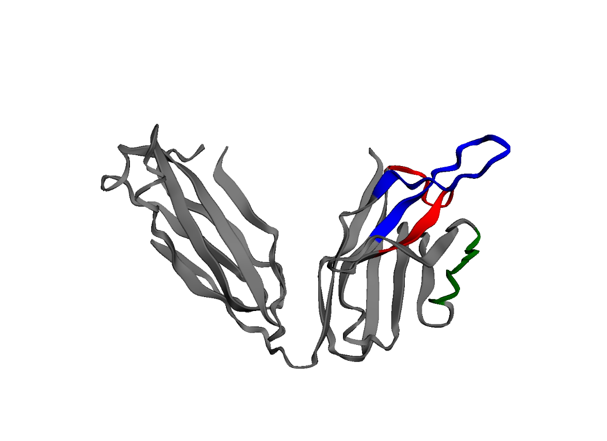

# SimBCR
SimBCR is a python project for simulating recombinant receptor 3D structure in a fully autonomous fashion.

> This is still an experimental build, once this project will be over a full documentation and contribution pipeline will be released.

## Current capability
1. Simulate variable regions (check literature \[1]) and join them with constant regions
2. Dynamically find CDR3 region
3. Autonomous protein folding (check literature \[2])
4. Autonomous local pdb rendering via OpenGL-based (check literature \[3]) rendering
5. Free camera movement around your 3d rendered pdb file
6. Autonomous web based pdb rendering via py3dmol and jupyter-notebook
7. Two different ways (rainbow and CDR) to color your antibody once folding is done 

## Installation
> WARNING: these are the minimum steps needed to run the CURRENT default behaviour of SimBCR. No other functionality is being supported 

1. In order to get all the necessary python packages run
`pip install -r requirements.txt`

2. You will need to install R and the immuneSIM package. Please refer to their [installation section](https://github.com/GreiffLab/immuneSIM). Assure yourself of adding R to your system PATH variables.
3. Finally, clone this repo or download and extract the raw files. 

## Usage
### Default 
Run main.py (from the root directory of the project) with 

`python main.py`

If everything runs smoothly, a window should open with your folded heavy chain (only the FAB portion).
Please keep in mind that the default settings simulate a human IgG heavy chain.
### Custom inputs
Right now simBCR allows you to customize your input in two different ways: simple mode and developer mode.
#### Custom inputs: simple mode
In order to run a custom simulation in the easiest way possible, provide the following inputs when launching main.py

`python main.py  --number_of_seqs 100 --species hs --receptor tr --chain b --name_repertoire my_custom_sim` 

This will allow you to simulate a human TCR-B chain and save it as a "name_repertoire".csv file.
The default way of running SimBCR translates to:

`python main.py  --number_of_seqs 10 --species hs --receptor ig --chain h --name_repertoire hs-igh-sim --renderer local`
#### Custom inputs: developer mode
If you really want to dig deeper into customization you can edit the `InputParser` instance in `main.py` by adding any of the available keys present in `InputParser.default_main_R_args` (check `InputParser.py`) as a kwarg. For example, replacing the current creation of `InputParser` with `
InputParser(args, smh_mode = "naive", smh_prob = 100/350)` will cause the simulation of a variable region where each 350 nucleotides 100 will get mutated in a random way.
Keep in mind that the key (smh_mode here, no quotes!) need to be present in `InputParser.default_main_R_args` and the value ("naive" here) should be treated as a raw R input.
Using custom inputs in this way is NOT recommended and please refer to the [original documentation](https://immunesim.readthedocs.io/en/latest/parameters.html) if you need more information. 

## Develop timeline from 24/12/23 on:
- [x] Simulate variable regions with this [R project](https://github.com/GreiffLab/immuneSIM)
- [x] Previously using [SWISS-MODEL](https://swissmodel.expasy.org/interactive) in order to get the 3d structure from the aminoacid sequence. Switched to ESMatlas API (even if it does not support more than 400AA prediction. Consider hybrid approach)
- [x] Dreaming of a custom OpenGL-based 3D renderer for custom display of folded protein. Currently, I am using py3dmol with hacky jupiter-notebook trick (check show_3d.py and render_pdb.ipynb)
- [ ] AlphaFold support? 
- [ ] CDR1 and CDR2 are still find in a hard coded, literature-based method. Is good enough?
- 

# SimBCR v2.0
> SimBCR is a novel approach to human's recombinant receptor 3D-rendering.

## Table of Contents
* [General Info](#general-information)
* [Features](#features)
* [Setup](#setup)
* [Showcase](#showcase)
* [Usage](#usage)
* [Project Status](#project-status)
* [Room for Improvement](#room-for-improvement)
* [Literature and resource references](#Literature-and-resource-references)
* [Contact](#contact)

## General Information
SimBCR is a click-and-go python project that allows you to quicly set up in silico VDJ recombination and then freely 
navigate the 3D world with your rendered recombinant receptor. 

Given just a few parameters from the terminal, SimBCR will run an in silico VDJ recombination thanks to [the work](#literature-and-resource-references) done by
Cédric R. Weber and Victor Greiff. Once the simulation is done, protein folding is achieved via [ESMatla](#literature-and-resource-references) API call. Upon retrieving
the .pdb file, a fully custom pdb-to-obj file converter is launched and, in the end, free 3D navigation around the model is available. 
This is done with a modified version of the [3D-Graphic-Engine project](#literature-and-resource-references) from StanislavPetrovV

## Features
1. Intuitive input system from the terminal 
2. Simulate variable regions and join them with constant regions 
3. Dynamically find CDR3 region 
4. Autonomous protein folding 
5. Autonomous local pdb rendering 
6. Free camera movement around your 3D rendered pdb file 
7. Autonomous web based pdb rendering via py3dmol and jupyter-notebook 
8. Two different ways (rainbow and CDR) to color your antibody once folding is done 

## Setup
> WARNING: these are the minimum steps needed to run the CURRENT default behaviour of SimBCR.

1. In order to get all the necessary python packages run
`pip install -r requirements.txt`

2. You will need to install R and the immuneSIM package. Please refer to their [installation section](https://github.com/GreiffLab/immuneSIM). Assure yourself of adding R to your system PATH variables.
3. Finally, clone this repo or download and extract the raw files. 

## Usage
SimBCR is ready to run with just `python main.py` once you have navigated to the installation directory. This will run 
SimBCR under default parameter which are:
- **name_repertoire**: choose the VDJ statistics' output filename. If nothing is provided a custom one will be generated 
- **number_of_seqs**: specify how many sequence will be simulated. In the end only one will get randomly selected but all are available in the "SimBCR-v2/from_immuneSIM/'name_repertoire'.csv" 
- **species**: choose if you want human (by writing --species hs) or murine (--species mm) recombinant receptors sequences 
- **receptor**: allows you to select which recombinant receptor will be simulated: TCR (--receptor tr) or BCR (--receptor ig) 
- **chain**: allows you to select which chain of the given receptor will be simulated: h & l for BCR/IG and a & b for TCR
- **renderer**: specify which pdb renderer you want to run. --renderer local will start an instance of PdbGraphicEngine while --renderer web will launch a web page where py3dmol and jupiter notebook will take care of rendering your .pdb file

Overall, default runs translates to `python main.py --number_of_seqs 100 --species hs --receptor ig --chain h --name_repertoire hs_igh_sim --renderer local`.
See the [Sample input](#sample-input) section for terminal-input examples.

Since SimBCR "manually" runs ImmuneSIM, you can hop into SimBCR-v2/from_immuneSIM/main.R and manually modify each 
parameter of immuneSIM function call. Note that you should treat these as raw R inputs. 

As a softer approach, you can edit the `InputParser` instance in `main.py` by adding any of the available keys present in `InputParser.default_main_R_args` (check `InputParser.py`) as a kwarg. 
For example, replacing the current creation of `InputParser` with `
InputParser(args, smh_mode = "naive", smh_prob = 100/350)` will cause the simulation of a variable region where each 350 nucleotides 100 will get mutated in a random way.
Keep in mind that the key (smh_mode here, no quotes!) need to be present in `InputParser.default_main_R_args` and the value ("naive" here) should be treated as a raw R input.
Using custom inputs in these two ways is NOT recommended and please refer to the [original documentation](https://immunesim.readthedocs.io/en/latest/parameters.html) if you need more information.

## Showcase
Sample output in local rendering

Sample output with CDR coloring in local rendering (R: CDR1 (estimate), G: CDR2 (estimate), B: CDR: 3)

Sample output with CDR coloring in web rendering

### Sample input
- Default run: `python main.py --number_of_seqs 100 --species hs --receptor ig --chain h --name_repertoire hs_igh_sim --renderer local`
- Beta chain of human TCR: `python main.py --receptor tr --chain b` (we can omit all those arguments that match the defaults)
- One sequence of the lambda chain of mice: `python main.py --number_of_seqs 1 --species mm --receptor ig --chain l`
- Web rendering of human BCR heavy chain: `python main.py --renderer web`

## Project Status
OpticReader is _complete_ and _currently not a priority_ to me. 
SimBCR is one of the first big projects (together with OpticReader) that I tried to tackle with discipline. With this being said,
as weird as it may sound, SimBCR was a proof of concept. Firstly, I wanted to test myself in writing better code and, hopefully, create something 
that can really be distributed and used/modified/improved by other people. I am quite happy with the result but, as I will state below, SimBCR can still improve a lot.
On a second note, I wanted a project that managed to bind a bunch of subject that I met in these years of studying (the final boost of inspiration came from [this video](https://www.youtube.com/watch?v=HNP79CiWTew)). 

In the end, SimBCR was the perfect match for all of 
these requirements and even if it's coming to its natural end, I am looking forward to work more on bio-computing and immunology.
In particular, my latest entry on the project list is inspired by [this work](https://www.nature.com/articles/s43588-022-00372-4) (on [biorxiv](https://www.biorxiv.org/content/10.1101/2021.07.06.451258v3)).

## Room for Improvement
I truly want to see SimBCR get bigger and better. Feel free to contribute to this project, I will keep an eye on all updates and I will keep working on SimBCR in my spare time.
Please note that SimBCR has been created to be a lightweight and easy to use and distribute project. All the changes should be done keeping this simple rules in mind. 
Currently, there are these changes that I would like to implement (someday).

### VDJ Recombination
- [ ] ImmuneSim is a wonderful tool, but it feels like cheating to leave all the heavy lifting of receptor recombination to it. A python implementation of ImmuneSim can be taken in consideration;
- [ ] Currently, there are some .fasta files available. Because of ImmuneSim they are no longer needed but, if the previous point were tackled, they are read to be used (available at [IMGT](https://www.imgt.org/download/V-QUEST/IMGT_V-QUEST_reference_directory/Homo_sapiens/));
- [ ] Multichain and synchronous sequence simulation is currently not supported. If that can be achieved, one can also think of folding and rendering full recombinant receptors and not just a chain. 

## Protein Folding
- [ ] Esmatlas works like a charm (for its speed and simplicity in particular) but has some limitation (like a cap at 400AA). Implementing protein folders like [AlphaFold](https://github.com/google-deepmind/alphafold) or [ImmuneBuilder](https://github.com/brennanaba/ImmuneBuilder) can be considered.

## PdbRendering
This topic can (and honestly should) have its own project section. The amount of improvements that can be done to the GraphicEngine are limitless but, considering everything, at some point ones has to stop. 
I will keep dreaming (until I make it) about a fully-fledged lightweight and customizable 3D-pdb renderer but until then, these are SOME of the most needed changes:
- [ ] geometry instancing. Currently, all the displayed geometry is "real geometry". This is a waste of resources and one can think of creating one cylinder and one sphere for a whole scene
- [ ] multi-key pressing and speed increase while holing shift
- [ ] customizable coloring scheme based on residue or atom indexes. Something has already been done in PdbtoObj.py (GeometryBuilder.calculate_sphere_on_coord() when texture_mode == "CDR")
- [ ] GUI for "in-game" parameter tweaking

And so much more... If you have any ideas to improve SimBCR please do not esitate to [contact](#contact) me.

## Literature and resource references
1. [ImmuneSIM article](https://academic.oup.com/bioinformatics/article/36/11/3594/5802461)
and its [GitHub repo](https://github.com/GreiffLab/immuneSIM) by Cédric R. Weber and Victor Greiff;
2. [ESMatlas API](https://esmatlas.com/about#api)
3. [Base Script for OpenGL renderer](https://github.com/StanislavPetrovV/3D-Graphics-Engine) from StanislavPetrovV

## Contact
Created by [Lorenzo Paolin](https://github.com/lorenzopol). If you have any request, doubt, or you need to contact me, feel free to open an Issue [*here*](https://github.com/lorenzopol/SimBCR-v2).